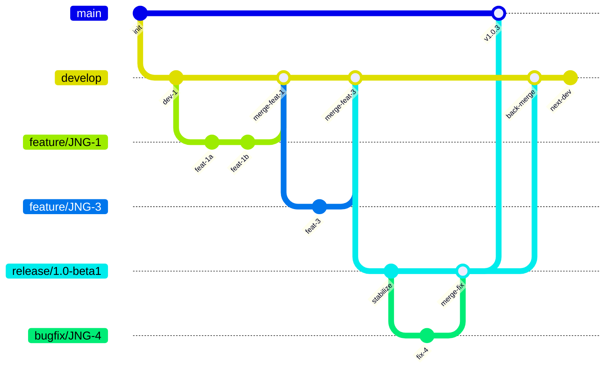
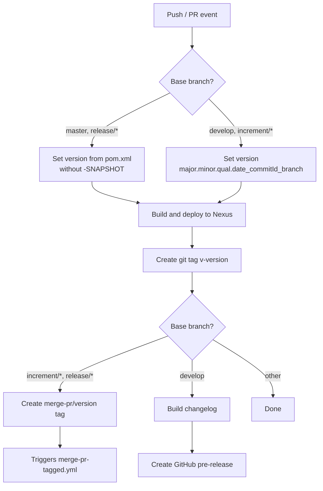
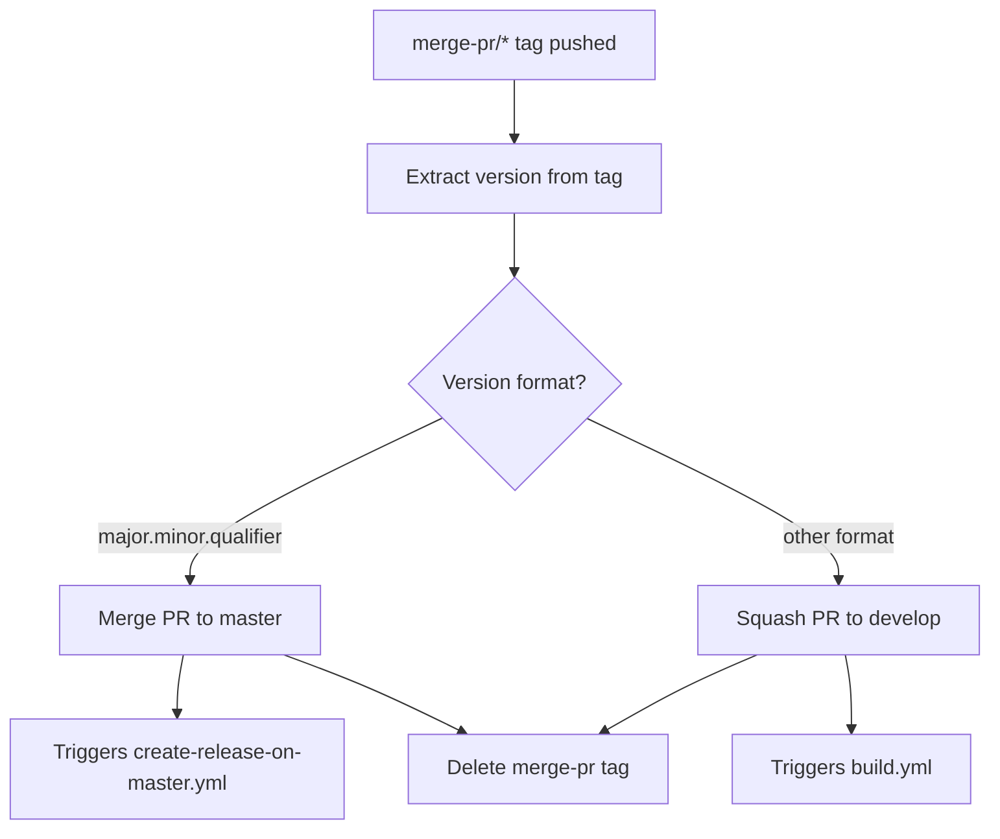
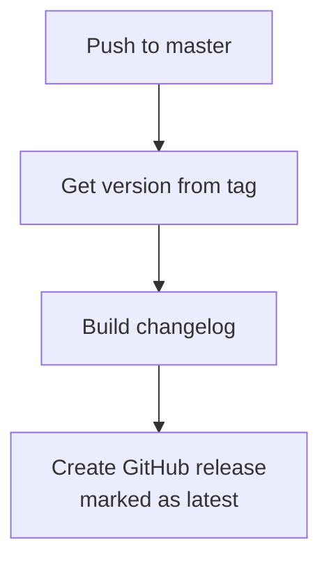
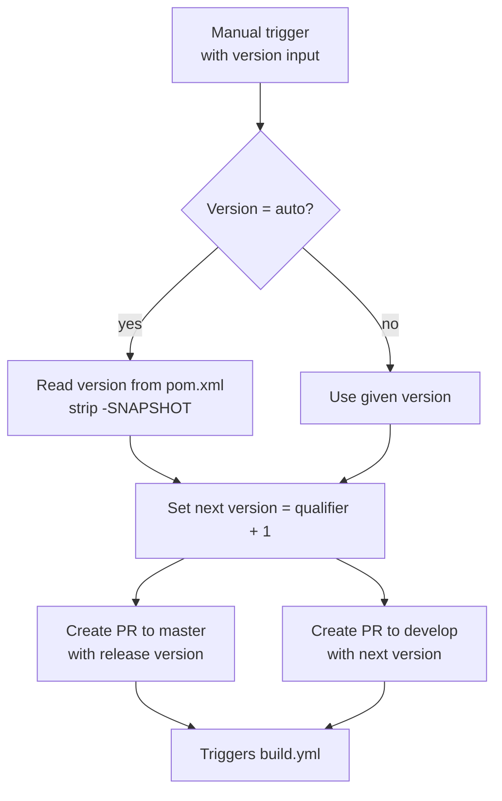
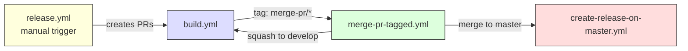

# Development Version and Branch Handling

This document describes the CI/CD pipeline, branching strategy, and version management for the swagger-p2 project.

## Branches

The versioning policy follows [GitFlow](https://www.atlassian.com/git/tutorials/comparing-workflows/gitflow-workflow). Each branch type serves a specific role in the development lifecycle:

| Branch | Purpose | Base branch |
|--------|---------|-------------|
| `develop` | Latest development sources of the current active version | — |
| `feature/JNG-NNN_summary` | New features for the next release | `develop` |
| `release/X.Y` (or `X_Y_betaN`) | Release stabilization and testing | `develop` |
| `bugfix/JNG-NNN_summary` | Fixes applied during release testing | `release/*` |
| `support/JNG-NNN_summary` | Minor updates to a previous release | `release/*` |
| `hotfix/JNG-NNN_summary` | Critical fixes for production | `master` |
| `master` | Latest released sources | — |

### Branch Flow

## Version Numbers

Versions follow **semantic versioning** with specific rules for each branch type:

| Event | Version action |
|-------|---------------|
| Create `feature/*` branch | No version change |
| Start `release/*` branch | Increment 2nd number on `develop` |
| Create `bugfix/*` branch | No version change (applied on release branch) |
| Create `support/*` branch | Increment 3rd number |
| Create `hotfix/*` branch | Increment 4th number |

## GitHub Actions Workflows

The CI/CD pipeline consists of several interconnected GitHub Actions workflows running on the `judong` custom runner with Java 21 (Zulu).

### build.yml — Main Build Pipeline

**Triggers:** Push to `develop`, pull requests to `develop`, `master`, `increment/*`, or `release/*`

### merge-pr-tagged.yml — Auto-merge Release PRs

**Trigger:** Push of a `merge-pr/*` tag

### create-release-on-master.yml — GitHub Release

**Trigger:** Push to `master` branch

### release.yml — Manual Release Trigger

**Trigger:** Manual workflow dispatch with a version parameter (`auto` or explicit `major.minor.qualifier`)

### Workflow Interaction Overview

### Other Workflows

| Workflow | Trigger | Purpose |
|----------|---------|---------|
| `build-dependabot.yml` | Dependabot PRs | Build and validate dependency updates |
| `bump-version.yml` | Manual dispatch | Increment project version |
| `create-release-tagged.yml` | Tag push `merge-pr/v*` | Create GitHub release on master for tagged versions |
| `jira-description-to-pr.yml` | PR creation | Sync JIRA ticket descriptions into PR body |
| `delete-old-draft-releases.yml` | Scheduled | Clean up stale draft releases |
| `sync-labels.yml` | Scheduled | Synchronize GitHub labels from configuration |

## How to Develop

Issue tracking uses [JIRA](https://blackbelt.atlassian.net/jira/dashboards).

> **Important:** There is no commit without a ticket number. Every pull request and commit message must include `JNG-XXX`.
