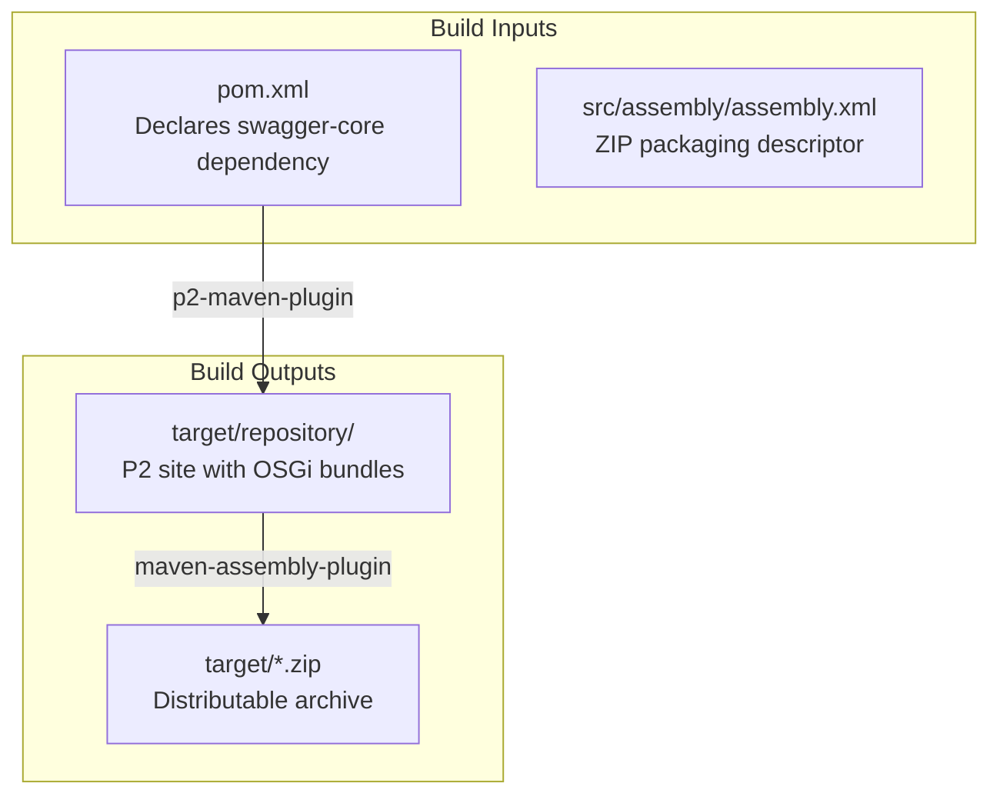
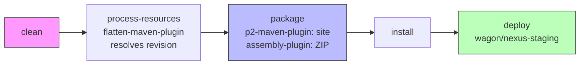

# Contributing to JUDO — swagger-p2

This guide covers everything needed to contribute to the swagger-p2 project: a Maven-based Eclipse P2 repository that wraps Swagger 1.5.24 as OSGi bundles.

## Development Environment

Before you start, make sure your setup matches the requirements in the parent project's [CONTRIBUTING guide](https://github.com/BlackBeltTechnology/judo-community/blob/develop/CONTRIBUTING.adoc).

| Requirement | Version | How to verify |
|-------------|---------|---------------|
| Java JDK | 21 | `java -version` |
| Maven | 3.9.4 | `./mvnw -version` (wrapper provided) |

## Project Structure

This is a **single-module packaging project** — there is no Java source code to compile. The build wraps an existing Maven artifact (`io.swagger:swagger-core:1.5.24`) into an Eclipse P2 update site.



> **Note:** The `CONTRIBUTING.adoc` in the parent JUDO community project references submodule types like `/feature`, `/site`, `/model`, and `/osgi`. Those do **not** apply to this project — swagger-p2 is a standalone P2 packager with no Eclipse plugin submodules.

## Build Commands

```bash
# Full build — generates P2 repository and ZIP archive
./mvnw clean install

# Quick rebuild — skip clean if only pom.xml changed
./mvnw install

# Deploy snapshot to JUDO Nexus
./mvnw clean deploy -Prelease-judong

# Deploy to Maven Central (requires GPG keys and Sonatype credentials)
./mvnw clean deploy -Prelease-central,sign-artifacts

# Test a local deploy to /tmp
./mvnw clean deploy -Prelease-dummy
```

## Build Lifecycle



### Maven Profiles

| Profile | Purpose |
|---------|---------|
| `sign-artifacts` | GPG-sign all artifacts before deploy |
| `release-dummy` | Deploy to local `/tmp` for testing |
| `release-judong` | Deploy to JUDO Nexus (snapshot + release) |
| `release-central` | Deploy to Maven Central via Sonatype OSSRH |
| `release-p2-judong` | Upload P2 site to JUDO Nexus P2 repo via WebDAV |
| `generate-github-asciidoc-diagrams` | Generate PNG diagrams from AsciiDoc CI/CD docs |
| `update-source-code-license` | Update EPL-2.0 license headers in source files |

## Version Policy

This project uses **CI-friendly versioning** with the `${revision}` Maven property (currently `1.0.4-SNAPSHOT`). The `flatten-maven-plugin` resolves this at build time so that published POMs contain concrete version numbers.

> **Note:** Maven uses `-SNAPSHOT` suffixes for development versions, while Eclipse uses `.qualifier`. The Tycho Versions Plugin handles this mapping in projects that use Tycho — this project does not use Tycho directly, so only the Maven convention applies.

Semantic versioning rules:
- **Major** — breaking changes to the bundled artifact set
- **Minor** — new bundled artifacts or upgraded dependency versions
- **Patch** — build fixes, metadata changes

## Git Workflow

The project follows **GitFlow** branching:

```mermaid
gitGraph
    commit id: "initial"
    branch develop
    commit id: "dev work"
    branch feature/JNG-123
    commit id: "feature"
    checkout develop
    merge feature/JNG-123
    branch release/1.0
    commit id: "stabilize"
    checkout master
    merge release/1.0 id: "v1.0.3"
    checkout develop
    merge release/1.0
    commit id: "next dev"
```

| Branch pattern | Base | Purpose |
|---------------|------|---------|
| `develop` | — | Latest development; default branch |
| `feature/JNG-*` | `develop` | New features |
| `release/*` | `develop` | Release stabilization |
| `bugfix/JNG-*` | `release/*` | Fixes during release testing |
| `support/JNG-*` | `release/*` | Minor updates to previous releases |
| `hotfix/JNG-*` | `master` | Critical fixes for production |
| `master` | — | Latest released version |

> **Important:** Every commit must include a JIRA ticket number (`JNG-XXX`). There is no commit without a ticket.

## Submitting an Issue

Before opening an issue, search [existing issues](https://github.com/BlackBeltTechnology/swagger-p2/issues) first. When filing a bug, include:

- Output of `java -version` and `mvn -version`
- Your `pom.xml` or `.flattened-pom.xml` if relevant
- A minimal reproduction case

File new issues using the [issue form](https://github.com/BlackBeltTechnology/swagger-p2/issues/new/choose).

## Submitting a Pull Request

This project follows [GitHub's standard forking model](https://guides.github.com/activities/forking/). Fork the repository and submit pull requests from your fork.
