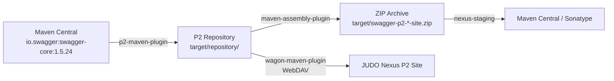

# Eclipse P2 Site of Swagger Dependencies

[](https://github.com/BlackBeltTechnology/swagger-p2/actions/workflows/build.yml)

## Introduction

This project builds an **Eclipse P2 repository** (update site) that bundles [Swagger 1.5.24](https://github.com/swagger-api/swagger-core/tree/v1.5.24) and its transitive dependencies as OSGi-compatible artifacts. Eclipse-based applications can consume these bundles through the standard P2 provisioning mechanism instead of managing JARs manually.

The build uses the [p2-maven-plugin](https://github.com/reficio/p2-maven-plugin) to generate P2 metadata and a compressed site archive (ZIP) that can be served as an Eclipse Update Site.

## How It Works



1. **Resolve** — Maven resolves `io.swagger:swagger-core:1.5.24` and all transitive dependencies from Maven Central
2. **Generate P2 site** — The `p2-maven-plugin` wraps each JAR as an OSGi bundle and generates P2 metadata (`content.xml`, `artifacts.xml`)
3. **Package** — The `maven-assembly-plugin` packages the repository directory into a distributable ZIP
4. **Deploy** — Depending on the active Maven profile, the artifacts are deployed to JUDO Nexus, Maven Central, or both

## Quick Start

```bash
# Build the P2 repository locally
./mvnw clean install

# The generated P2 site is at target/repository/
# The ZIP archive is at target/swagger-p2-<version>-site.zip
```

## Requirements

| Tool | Version | Notes |
|------|---------|-------|
| Java | 21 | Zulu distribution recommended |
| Maven | 3.9.4 | Provided via `./mvnw` wrapper |

## Deployment Profiles

| Profile | Command | Target |
|---------|---------|--------|
| `release-judong` | `./mvnw deploy -Prelease-judong` | JUDO Nexus snapshots |
| `release-central` | `./mvnw deploy -Prelease-central,sign-artifacts` | Maven Central (Sonatype) |
| `release-p2-judong` | `./mvnw deploy -Prelease-p2-judong` | JUDO Nexus P2 site via WebDAV |
| `release-dummy` | `./mvnw deploy -Prelease-dummy` | Local `/tmp` directory (testing) |

## Contributing

See the [Contributing Guide](CONTRIBUTING.md) for development environment setup, branching strategy, and submission guidelines.

## License

This project is licensed under the [Eclipse Public License - v 2.0](https://www.eclipse.org/legal/epl-2.0/).
